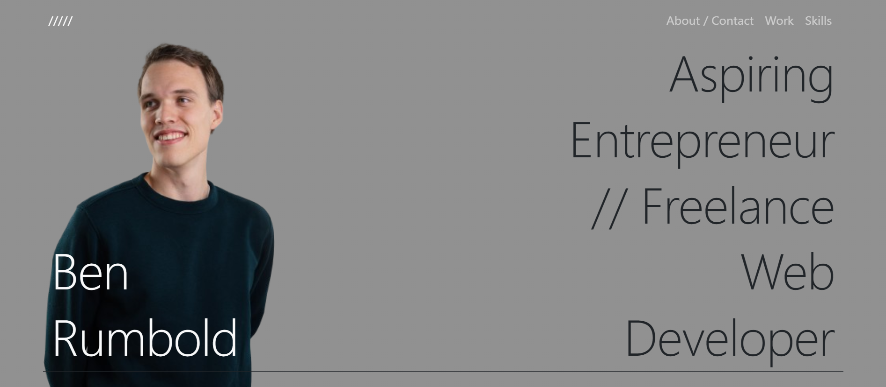
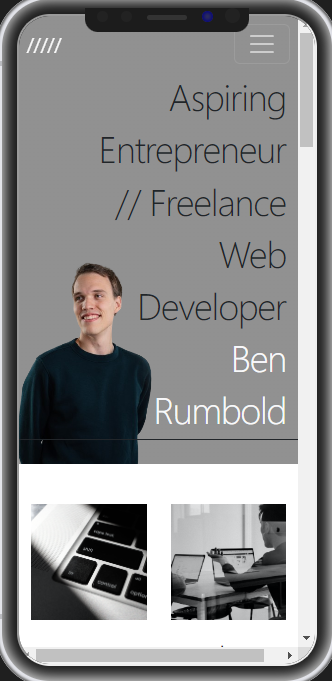

# Ben Rumbold Bootstrap Portfolio

## Description

https://ben-rumbold.github.io/ben-rumbold-portfolio-bootstrap/

Professional, responsive web development portfolio to showcase my work, made with HTML, CSS, JavaScript and Bootstrap. Featuring:
- Transparent navbar which transforms to solid colour on scroll.
- Navbar which collapses and creates a hamburger menu at medium screen widths and below.
- Navbar with links to corresponding section of webpage.
- 'About Me' section with responsive images.
- 'Portfolio' section with cards of work with links to corresponding webpage.
- 'Coming soon' page for not yet completed work examples, with button that redirects users back to the portfolio.
- 'Contact Me' section links to corresponding website.

## Table of Contents (Optional)

- [Installation](#installation)
- [Usage](#usage)
- [Credits](#credits)
- [License](#license)

## Installation

https://ben-rumbold.github.io/ben-rumbold-portfolio-bootstrap/

## Usage

*Laptop (1440px)*

*Mobile (425px)*
    

## Credits

- Design inspired by (specifically hero section): https://dennissnellenberg.com/
- Tutorial for navbar (JavaScript): https://www.youtube.com/watch?v=z70GTU3p72I
- Hero picture: Dennis Snellenberg
- All other images: https://unsplash.com/

## License

MIT License

Copyright (c) 2023 Ben Rumbold

Permission is hereby granted, free of charge, to any person obtaining a copy
of this software and associated documentation files (the "Software"), to deal
in the Software without restriction, including without limitation the rights
to use, copy, modify, merge, publish, distribute, sublicense, and/or sell
copies of the Software, and to permit persons to whom the Software is
furnished to do so, subject to the following conditions:

The above copyright notice and this permission notice shall be included in all
copies or substantial portions of the Software.

THE SOFTWARE IS PROVIDED "AS IS", WITHOUT WARRANTY OF ANY KIND, EXPRESS OR
IMPLIED, INCLUDING BUT NOT LIMITED TO THE WARRANTIES OF MERCHANTABILITY,
FITNESS FOR A PARTICULAR PURPOSE AND NONINFRINGEMENT. IN NO EVENT SHALL THE
AUTHORS OR COPYRIGHT HOLDERS BE LIABLE FOR ANY CLAIM, DAMAGES OR OTHER
LIABILITY, WHETHER IN AN ACTION OF CONTRACT, TORT OR OTHERWISE, ARISING FROM,
OUT OF OR IN CONNECTION WITH THE SOFTWARE OR THE USE OR OTHER DEALINGS IN THE
SOFTWARE.

## Badges

## Features

- Transparent navbar which transforms to solid colour on scroll.
- Navbar which collapses and creates a hamburger menu at medium screen widths and below.
- Navbar with links to corresponding section of webpage.
- 'About Me' section with responsive images.
- 'Portfolio' section with cards of work with links to corresponding webpage.
- 'Coming soon' page for not yet completed work examples, with button that redirects users back to the portfolio.
- 'Contact Me' section links to corresponding website.

## How to Contribute

https://www.contributor-covenant.org/version/2/1/code_of_conduct/code_of_conduct.md

## Tests

N/A